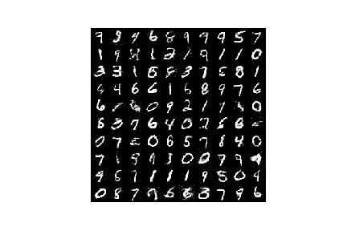

# Generative Adversarial Networks - A Starter
In this repository a GAN is trained to create digits that resemble the MNIST dataset. The code is from the nice tutorial of Diego Gomez Mosquera, whoc published it on [github](https://github.com/diegoalejogm/gans) and in a [blog post](https://medium.com/ai-society/gans-from-scratch-1-a-deep-introduction-with-code-in-pytorch-and-tensorflow-cb03cdcdba0f).

